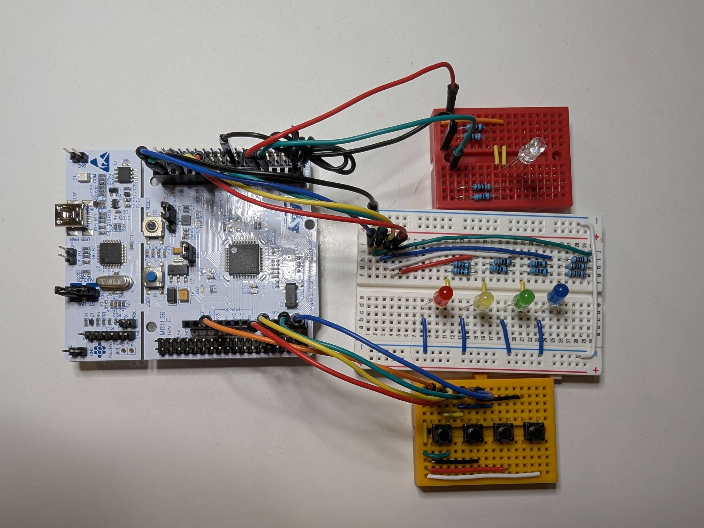

# STM32 Bare-Metal "Simon Says" Game 🎮

This project is a classic "Simon Says" memory game implemented on an **STM32L476RG** microcontroller using **bare-metal programming**. It's written entirely in C and manipulates hardware registers directly without relying on the STM32 HAL (Hardware Abstraction Layer), except for the basic CMSIS device headers.

The game generates a sequence of colors, and the player must repeat the sequence by pressing the corresponding buttons. With each successful round, the sequence gets longer. The game ends if the player makes a mistake or completes the maximum pattern size.

---

## Hardware Requirements 💡

-   **Microcontroller**: STM32L476RG (on a Nucleo-L476RG board or similar)
-   **LEDs**:
    -   1x Red LED
    -   1x Yellow LED
    -   1x Green LED
    -   1x Blue LED
-   **Status LEDs**:
    -   1x Red Status LED (for failure)
    -   1x Green Status LED (for success)
-   **Buttons**:
    -   4x Push-buttons (one for each color)
-   **Misc**: Breadboard, jumper wires, and resistors

---

## Pinout 📌

The project uses the following GPIO pin connections. Ensure your hardware is wired accordingly.

| Component        | Port    | Pin |
| ---------------- | ------- | --- |
| **Game LEDs**    |         |     |
| Red LED          | `GPIOA` | 7   |
| Yellow LED       | `GPIOA` | 6   |
| Green LED        | `GPIOB` | 9   |
| Blue LED         | `GPIOB` | 8   |
| **Game Buttons** |         |     |
| Red Button       | `GPIOA` | 0   |
| Yellow Button    | `GPIOA` | 1   |
| Green Button     | `GPIOC` | 1   |
| Blue Button      | `GPIOC` | 0   |
| **Status LEDs**  |         |     |
| Red Status LED   | `GPIOB` | 4   |
| Green Status LED | `GPIOB` | 5   |

---

## How to Use 🛠️

1.  **Clone the Repository**:

    ```bash
    git clone <your-repository-url>
    ```

2.  **Open in STM32CubeIDE**:

    -   Launch STM32CubeIDE.
    -   Go to **File > Open Projects from File System...**.
    -   Select the cloned repository folder as the "Import source" and click **Finish**.

3.  **Build the Project**:

    -   Right-click on the project in the Project Explorer.
    -   Select **Build Project** (or press `Ctrl+B`).

4.  **Flash to Device**:
    -   Connect your STM32 board to your computer.
    -   Click the **Run** button (green play icon) in the toolbar to flash the program to the microcontroller. The game's start-up sequence should begin automatically.

---

## Code Overview 💻

The entire program logic is contained within `main.c` and is designed to be self-contained.

-   **`main()`**: The entry point of the application. It initializes the MCU clock to 80MHz, sets up the SysTick timer for millisecond delays, configures all GPIOs, seeds the random number generator, and enters the main game loop.
-   **Game Loop**:
    1.  `game_generate_pattern()`: Creates and displays a new random color sequence for the current round.
    2.  `game_get_player_input()`: Waits for the player to press the buttons, debounces the input, and validates it against the generated pattern.
    3.  `game_handle_status()`: Blinks the green status LED on success or the red one on failure. The game resets if the player fails or wins.
-   **Hardware Initialization**: All hardware is configured through direct register manipulation.

## Preview 📹

For additional images navigate to "/Media/" where you'll find my physical implementation as well as a demo video


